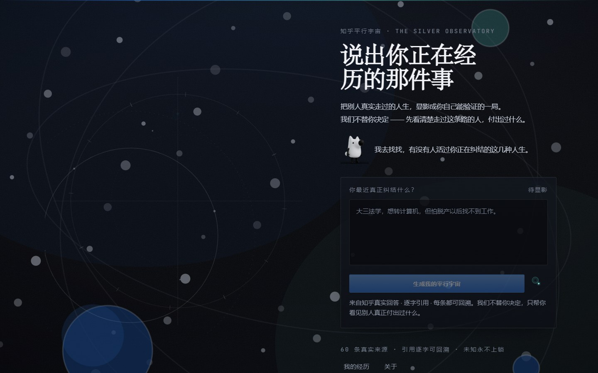
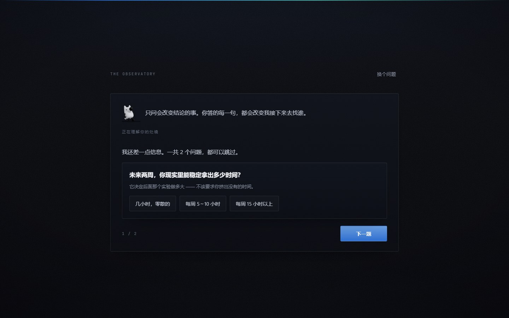
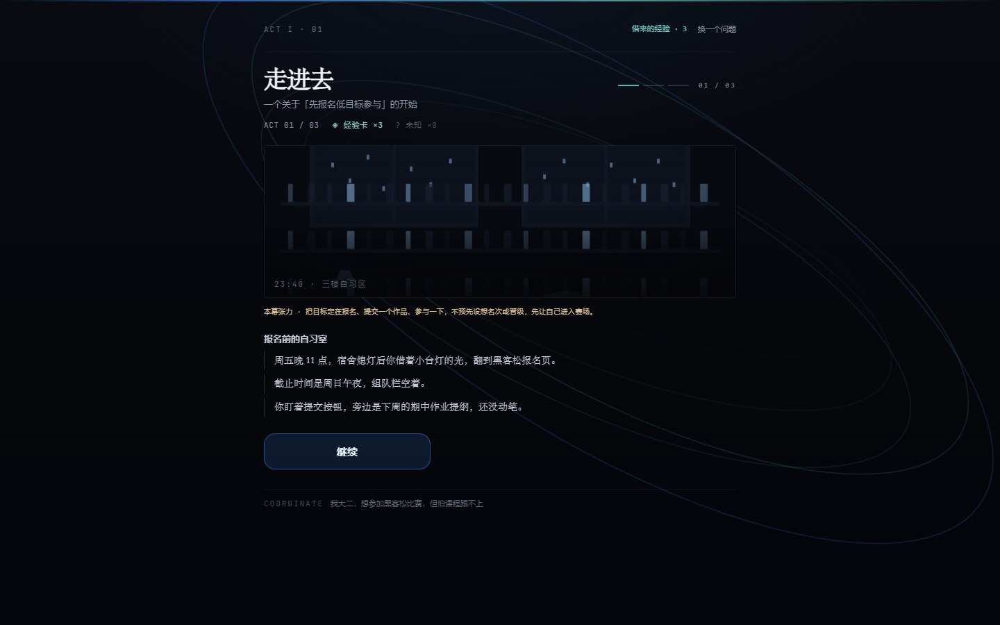
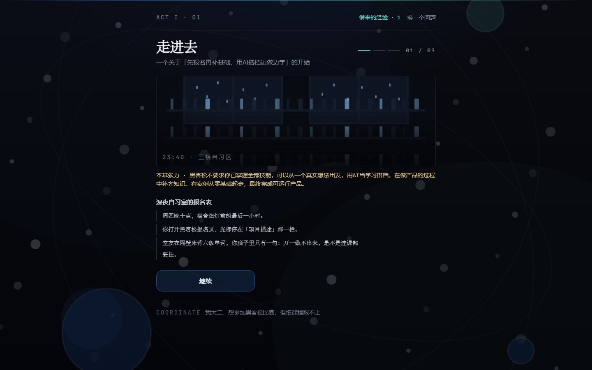
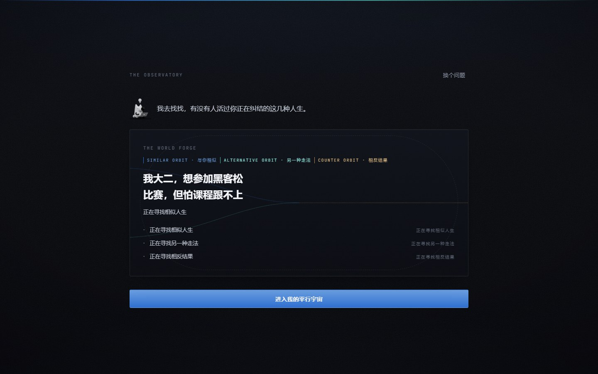

# 知乎平行宇宙 · Zhihu Multiverse

> 把别人真实走过的人生，显影成你自己能验证的一局。

说出你正在经历的那件事，系统会先在知乎寻找**完整同路经历**；如果样本不足，
再逐层放宽到相似起点、同类背景、相同终点与相邻路径。每一层都标明差异，
不会把不相关的故事伪装成答案。

**知乎黑客松 2026 · 校园新锐季** | 主赛道：跨次元游乐场 | 关联方向：知识炼金场

<p align="center">
  
</p>
<p align="center">
  
</p>
<p align="center">
  
</p>
<p align="center">
  
</p>
<p align="center">
  
</p>

---

## 为什么必须是知乎

普通 AI 问答给你一段建议；这里的**知乎内容不是参考资料，而是世界的规则**。

| 机制 | 玩家能感觉到什么 | 代码落点 |
|---|---|---|
| **先找人，再谈相似** —— 先查精确起点；不足两位时才用一次短 AI 扩展，按相似起点 / 同类背景 / 相同终点 / 相邻路径逐层放宽 | 找不到完全相同的人时，也能看清“哪里相同、哪里不同”；同一问题 24 小时内复用扩展结果 | `features/experience/transitionIntent.ts` · `features/experience/qualification.ts` · `features/experience/retrieve.ts` |
| **逐字引用** —— `exactQuote` 必须是原回答的连续子串，改一个字整条丢弃 | 每句话都能点回那一篇真实回答 | `features/experience/validate.ts` |
| **Experience Unlock** —— 一条真实经历会在某一幕解锁一个此前不存在的行动 | 「他的做法我原来根本没想到」 | `features/game-world/experienceUnlock.ts` |
| **反例驱动第三幕** —— 找不到真实反例就诚实留空，不编 | 「原来看起来对的路，有人是这样走坏的」 | `features/game-world/compileWorld.ts` |
| **Unknown Lock** —— 只有现实能回答的事，在游戏里永远锁着 | 「这个不是 AI 能替我猜的」 | `features/game-mechanics/unknownLock.ts` |
| **Reality Pass** —— 终局不判卷，给一条带成功信号与停止信号的现实支线 | 「我知道接下来该验证什么了」 | `features/game-world/questView.ts` |

一条贯穿全链的纪律：**不替玩家编答案**。没有证据就留空，并把它显式标成「未显影」。

## 一局怎么走

```
首页输入困惑
   ↓  0~2 个澄清问题（只问会改变结论的条件；你说过的绝不重复问）
三视角检索 → 逐字提取 → 校验 exactQuote
   ↓  World Forge：相似 / 另一种 / 反例三条轨道各自 materialize
三幕平行世界（第一幕引入、第二幕解锁、第三幕由真实反例驱动）
   ↓  每次抉择消耗「借来的经验」，未显影区永不补全
终局：问题被重写 → 交还一条现实支线
```

## 快速开始

```bash
npm install
cp .env.example .env.local     # 填 APP_LLM_API_KEY 与 APP_ZHIHU_ACCESS_SECRET
npm run dev                    # http://localhost:3000
```

没有 key 时也能跑：检索会退回离线快照，界面保持「剧本模拟引用」，**不会编造赞同数**。

### 环境变量

| 变量 | 必填 | 说明 |
|---|---|---|
| `APP_LLM_API_KEY` | 是 | 模型密钥，只在服务端读取（敏感凭证统一由 `src/config/serverEnv.ts` 管理） |
| `APP_LLM_BASE_URL` | 是 | 兼容 OpenAI 协议的端点 |
| `APP_LLM_FAST_MODEL` / `APP_LLM_DEEP_MODEL` | 否 | 不配则两者都用同一模型 |
| `APP_LLM_JSON_MODE` | 否 | 默认 `true`；端点不支持 `json_object` 时才关 |
| `APP_ZHIHU_ACCESS_SECRET` | 否 | 知乎开放平台 Access Secret，用于真实站内语料 |

> ⚠️ 密钥绝不入库。仓库带 `scripts/check-secrets.mjs` 闸门，配合
> `git config core.hooksPath .githooks` 后每次提交自动拦截。

### 拉取真实来源快照

```bash
npm run sync:zhihu     # 需 ZHIHU_ACCESS_SECRET；落盘成可核查的快照（含 retrievedAt）
```

## 常用命令

```bash
npm run dev          # 开发服务器
npm run build        # 生产构建（standalone 产物）
npm run typecheck    # tsc --noEmit
npm run test         # vitest run
npm run test:stats   # 重新生成 scripts/test-stats.json
npm run smoke        # 主链 HTTP 冒烟
npm run verify       # typecheck + test + build + smoke
```

## 测试

当前实测（`scripts/test-stats.json`，由 `npm run test:stats` 生成，不手写数字）：

```
以 `scripts/test-stats.json` 为准 · CI 全部通过
```

契约覆盖三条主线：**产品纪律**（三视角检索、逐字引用、未知永不补全）、
**主链技术身份**（陌生问题 → 动态澄清 → 检索 → 逐字片段 → 三幕蓝图 → 经验卡 → DM 逐字引用，全程 fake 注入不碰真网络）、
**设计系统**（单一 token 体系、无霓虹外发光、reduced-motion 降级）。

## 目录结构

```
src/
├── app/                      # Next.js App Router
│   ├── page.tsx              # 首页：命运观象厅 + 唯一入口
│   ├── play/page.tsx         # 推演舱
│   ├── session/[id]/page.tsx # 世界生成中转：澄清 → prepare-world → World Forge
│   ├── journal/ · settings/ · about/
│   └── api/                  # dm / sessions / settings / profile / health / memory / zhihu / oauth
├── core/
│   ├── evidence/             # 检索规划 / 证据网格 / 事实强度
│   ├── dm/                   # AI DM 五层容错防御
│   ├── decision/ · run/ · usage/ · oauth/ · zhihu/
│   ├── memory.ts             # 跨周期记忆 / 决策画像
│   └── observability.ts      # 结构化日志（技术细节只进日志，不进页面）
├── features/
│   ├── experience/           # 澄清 / 检索计划 / 逐字校验 / 提取
│   ├── game-world/           # 三幕编译 / 经验解锁 / 现实支线
│   ├── game-mechanics/       # 行动空间 / 遭遇 / 未知锁定
│   └── decision-session/ · reality-memory/ · run/
├── components/
│   ├── visual/               # 观象厅：AstralDial / WorldForge / CelestialBackdrop / RealityPass …
│   ├── game/                 # 经验卡 / 来源角标 / session 推演屏
│   ├── characters/ · scenes/ · session/
│   # 注：visual/ 里的 OrbitField 与 Kanshan 是设计留档（不再挂载，由 observatory 契约守护）
│   └── AppearanceBootstrap.tsx
├── config/serverEnv.ts       # APP_* 的唯读入口（浏览器里调用会直接抛错）
├── data/                     # 角色 / 场景 / 黄金案例 / 知乎来源快照
└── types/                    # 类型契约
```

## 设计系统：银盐观象台

视觉只有一个事实源 —— `src/app/silver.css`，一套 `--sil-*` token，**不保留别名**。

三条不可违反的纪律：

1. **材质先于配色。** 暗房是物理空间：相纸有纤维、镜头有晕影、显影液有密度。颜色只用来区分证据的三种意图，不用来装饰。
2. **未知永不补全。** 未显影区没有 hover、没有估值、没有「暂无数据」的占位数字 —— 它只有一种状态：还没显影。
3. **暖色只属于现实层。** 相纸暖白只出现在终局那张「要带走的纸」上。

三个机制：**显影** Development（620ms 入场）· **极光带** Aurora（全站唯一的情绪指示器）· **三层世界** Three Planes。
中文正文走系统字体栈（不额外下载 Noto Serif SC）；自托管只有拉丁等宽（JetBrains Mono，6 个 woff2 / 约 65KB），因为「仪器读数」需要它。

## 部署

```bash
cp .env.production.example .env.production   # 填真实密钥（.gitignore 已忽略）
docker compose up -d --build
```

- 镜像基于 `output: standalone` 多阶段构建；容器**只监听回环** `127.0.0.1:3000`，由宿主 Nginx 反代。
- 根文件系统 `read_only`，账号记忆通过命名卷 `memory-data` 落盘。
- 生产密钥由 `env_file` 在运行时注入，**不进镜像层**（`.dockerignore` 已排除 `.env*`）。
- Nginx 在 TLS 终止处做边缘限流：`/api/dm` 与 `/api/sessions` 是最紧的两道闸（这两条会真实消耗额度）。
- 应用层另有四道配额闸（每局模型调用 / 每身份每小时 / 每身份每日 / 全站每日 / 每 IP），见 `core/usage/`。

> ⚠️ 不要横向扩容。OAuth 会话在 Node 进程内存里，多副本会导致「刚授权成功，刷新就掉了」。

## 致谢

- 中文衬线体使用系统字体栈；动效全部为原生 CSS keyframes，未引入动画库。
- 运行时依赖只有 React 与 Next.js。
